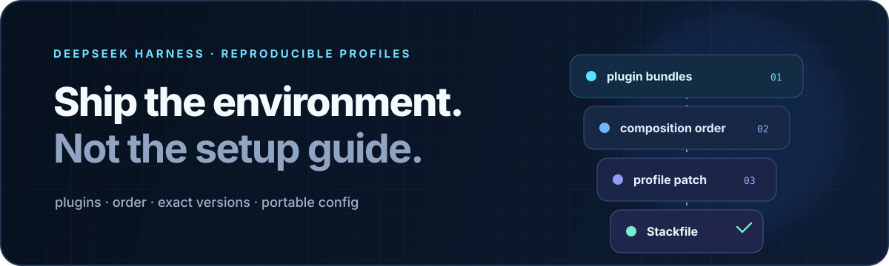

<p align="center">
  
</p>

<h1 align="center">dsh-stack</h1>

<p align="center">
  <strong>Make agent environments reproducible.</strong><br>
  Capture an entire DeepSeek Harness profile—plugins, order, versions, and portable configuration—in one reviewable Stackfile.
</p>

<p align="center">
  <a href="https://github.com/weivwang/dsh-stack/actions/workflows/ci.yml"></a>
  
  
  
</p>

<p align="center"><a href="README.zh.md">中文</a> · English</p>

---

## A plugin list is not an environment

A working Harness profile depends on more than the packages it contains. Bundle order changes composition. Version drift changes behavior. The profile patch carries the configuration that made the setup useful in the first place.

`dsh-stack` captures that complete contract:

- ordered plugin bundles;
- exact installed registry versions and commit-pinned Git sources;
- the profile-level Cordis patch, with local paths made portable;
- secret references instead of credential values;
- source Harness version and whole-file SHA-256 integrity.

The result is a small JSON Stackfile that can live beside a project, release, benchmark, team handbook, or bug report. Anyone can inspect it before allowing it to touch a profile.

## From working profile to verified replica

```sh
# Machine A — capture the environment that already works
dsh-stack export --profile web --name "research-workbench"

# Machine B — inspect before trusting
dsh-stack inspect web.dsh-stack.json
dsh-stack plan web.dsh-stack.json --profile research

# Reproduce, then verify through Harness itself
dsh-stack apply web.dsh-stack.json --profile research --yes
```

`apply` does not stop at installing packages. It writes the declared bundle order, hydrates portable configuration, and asks `dsh --dump-config` to verify the final composition. If verification fails, the profile files are restored from backup.

Stackfiles may also be loaded directly over HTTPS:

```sh
dsh-stack plan https://example.com/research.dsh-stack.json --profile research
```

## Install from GitHub

The current release is installed from source:

```sh
git clone https://github.com/weivwang/dsh-stack.git
cd dsh-stack
pnpm install --ignore-scripts
pnpm run build

# Expose the CLI, then add the Harness bundle to a profile
npm link
dsh plugin --profile web add "$PWD"
```

The package contains prebuilt JavaScript and has no install-time lifecycle script.

## Review first, mutate second

The read path and write path have deliberately different authority:

| Command | Writes to a profile | Purpose |
|---|:---:|---|
| `dsh-stack inspect` | No | Validate integrity and explain a local or HTTPS Stackfile |
| `dsh-stack plan` | No | Compare the desired stack with a target profile |
| `dsh-stack export` | No | Capture an installed profile into a new file |
| `dsh-stack apply` | Yes | Apply a reviewed plan with locking, backup, verification, and rollback |

Before mutation, `apply`:

1. validates a closed schema and the whole-file digest;
2. rejects unsafe package specifiers, local paths, mutable sources, and embedded URL credentials;
3. prints the exact install, update, ordering, patch, and secret plan;
4. requires `--yes`;
5. requires a second explicit choice before replacing a different non-empty patch.

It never removes target-only plugins. Existing bundles not named by the Stackfile remain after its declared layers.

## Secrets stay out of the file

The exporter parses `cordis.patch.yml` as data and never evaluates `!!js`. Common credential fields and recognizable token literals become environment-backed placeholders:

```yaml
apiKey: "{{DSH_STACK_SECRET:API_KEY}}"
cacheDir: "{{DSH_HOME}}/cache"
workspace: "{{HOME}}/code"
```

`inspect` lists every required variable. Supply the values only on the receiving machine:

```sh
export DSH_STACK_SECRET_API_KEY='...'
dsh-stack apply team.dsh-stack.json --profile web --yes
```

Automatic detection is defense in depth, not proof that arbitrary configuration is secret-free. Inspect a Stackfile before publishing it, and prefer managed credentials or environment references so raw secrets never enter the profile patch.

## What crosses the boundary

| Included | Deliberately excluded |
|---|---|
| Ordered `dsh.profile.bundles` | Session history |
| Exact package versions | Credentials and `.env` files |
| Profile-level `cordis.patch.yml` | Global `$DSH_HOME/cordis.patch.yml` |
| Portable home-path placeholders | Workspace files and arbitrary skills |
| Harness version and integrity digest | Machine-wide state |

A Stackfile is an environment declaration, not a backup archive.

## Harness tool

Installing the bundle registers one read-only model tool: `stack_inspect`.

- `summary` returns bundle counts, portability score, required secrets, and warnings.
- `stack` returns the complete integrity-sealed, secret-redacted JSON.

The tool itself never writes a Stackfile. Saving the returned JSON remains subject to Harness's ordinary file permissions.

## Compatibility and development

The first release targets DeepSeek Harness `0.1.0-rc.6` and Node.js `^22.19.0 || >=24`. Harness is in developer preview; each Stackfile records its source version and warns when the target differs.

```sh
pnpm install --ignore-scripts
pnpm run check
```

The checked-in `lib/` directory is the installable artifact. CI runs type checking, 18 tests, a production build, and package inspection across Linux, macOS, and Windows on Node 22.19 and 24.

Read the [format and mutation design](docs/design.md) or the [security policy](SECURITY.md).

MIT
